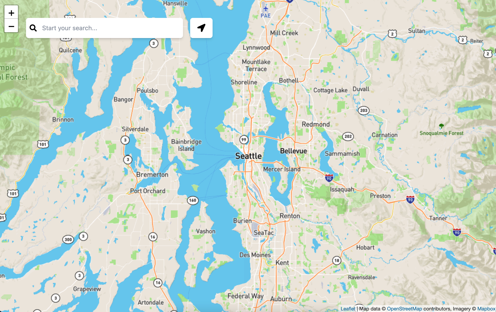

# Geocoding App

This map app allows users to search for anything that is nearby their location. User can treat it as Google Maps.

## Visuals


## Installation
Make sure that you have [NodeJS](https://nodejs.org) and [npm](https://www.npmjs.com/). **Note: When you install NodeJS, it installs npm along with it.**

There are two folder in this repo. The first one is the client and the second one is server. 
In order to run the application in the client directory, navigate to client directory and run ```npm i``` to install all the dependencies and then ```npm run serve``` to serve up the local development.

The server directory is the same thing, navigate to the ```server``` directory and run ```npm i``` to install all the dependencies and then run ```node index.js``` to spin up the local server.

## Support
If issue exists, please open up an issue to notify me so I can go ahead and fix those changes.

## Authors and acknowledgment
- [Leon Xu](https://github.com/leonxu260)
- [Leaflet](https://leafletjs.com/)
- [Mapbox API](https://mapbox.com)
